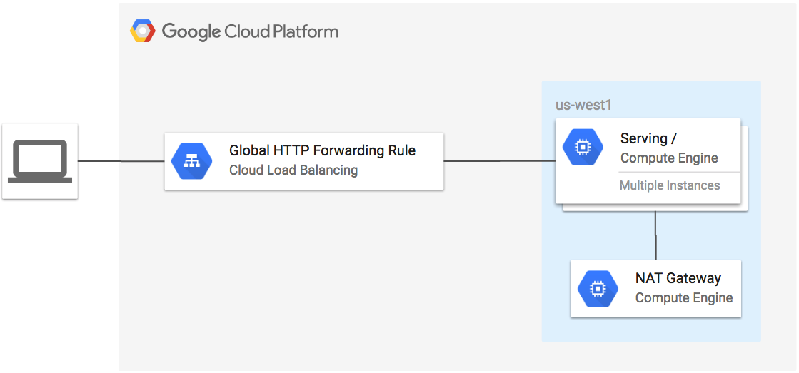

# HTTP LB Example to GCE instances with NAT Gateway with RATE.

[](https://console.cloud.google.com/cloudshell/open?git_repo=https://github.com/GoogleCloudPlatform/terraform-google-lb-http&working_dir=examples/http-nat-gateway&page=shell&tutorial=README.md)

This example creates a global HTTP forwarding rule to an instance group without external IPs. The instances access the internet via a NAT gateway.

**Figure 1.** *diagram of Google Cloud resources*



## Change to the core directory

```
[[ `basename $PWD` != abhishek-plagood ]] && cd abhishek-plagood
```

## Install Terraform

1. Install Terraform if it is not already installed (visit [terraform.io](https://terraform.io) for other distributions):

## Set up the environment

1. Set the project, replace `YOUR_PROJECT` with your project ID:

```
PROJECT=YOUR_PROJECT
```

```
gcloud config set project ${PROJECT}
```

2. Configure the environment for Terraform:

```
[[ $CLOUD_SHELL ]] || gcloud auth application-default login
export GOOGLE_PROJECT=$(gcloud config get-value project)
```

## Run Terraform

```
terraform init
terraform apply
```

## Verify the deployment

```
$(echo http://$(terraform output load-balancer-ip) | sed 's/\"//g')
```

## Load Testing

1. Open the URL of the load balancer in your browser:

```
./load-test.sh
```

## Cleanup

1. Remove all resources created by terraform:

```
terraform destroy
```
